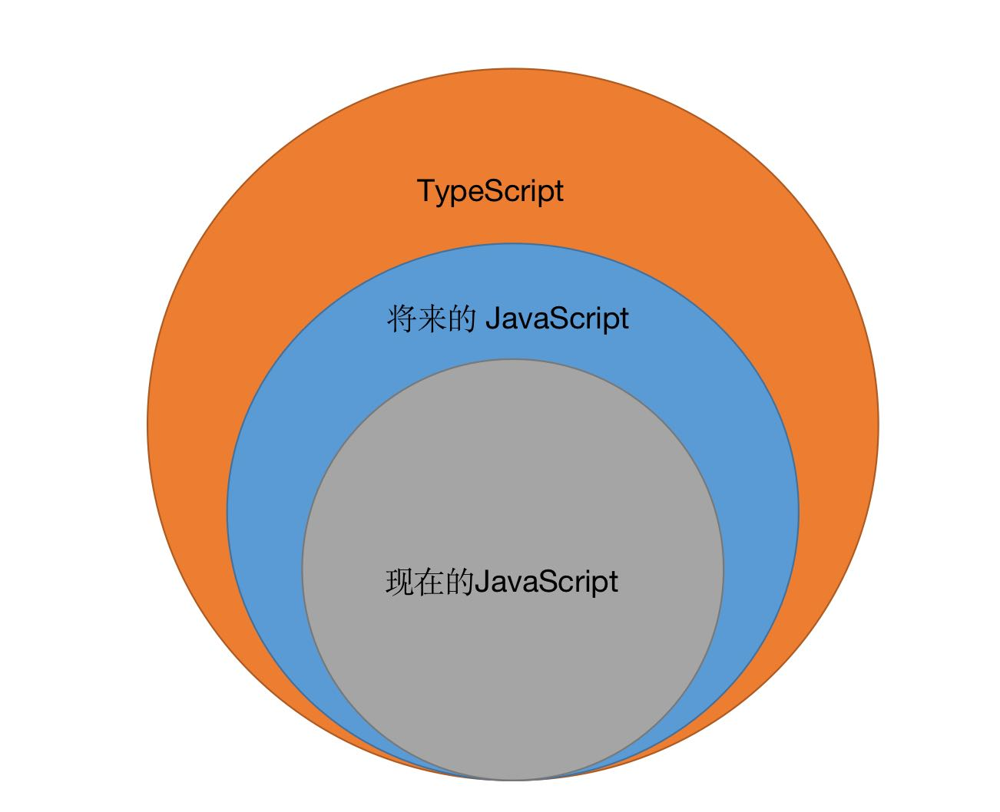

# TypeScript 基础

## TypeScript 实现了什么

---

1. 为 JavaScript 提供了可选的类型系统（类型）
2. 兼容了当前以及未来的 JavaScript 特性（超集）

## TypeScript 与 JavaScript 的关系

---



* TypeScript 是 JavaScript 的超集（TypeScript 向下兼容 JavaScript，TypeScript 有的特性 JavaScript 不一定有，JavaScript 有的特性，TypeScript 都有）
* 相对于 JavaSript，TypeScript 多了一个类型标注和类型推导，一旦变量、函数或者类的类型确定，则在传递值或者参数时必需传入相应的类型

  ```ts
  let num: number
  num = 0
  num = 'hello world' // Error: Type 'string' is not assignable to type 'number'.
  ```

## TypeScript 基础数据类型

---

### 相同

---

#### 数字（number）

  与 JavaScript 一样， TypeScript 里的所有数字都是浮点数。

  除了支持十进制和十六进制字面量，TypeScript 还支持 ECMAScript 2015 中引入的二进制和八进制字面量

  ```ts
  let decLiteral: number = 6;
  let hexLiteral: number = 0xf00d; // 十六进制
  let binaryLiteral: number = 0b1010; // 二进制
  let octalLiteral: number = 0o744; // 八进制
  ```

#### 布尔（boolean）

  最基本的数据类型就是简单的 true/false 值

  ```ts
  let isDone: boolean = false;
  ```

#### 字符串（string）

  表示文本数据类型，可以使用双引号或单引号表示字符串。

  ```ts
  let name: string = "bob";
  name = "smith";
  ```

  还可以使用模版字符串，它可以定义多行文本和内嵌表达式。 被反引号包围(`)，并且以 ${ key } 形式嵌入表达式。

  模板字符串的好处就是能还原变量字符串原有的结构，换行可以不适用换行符。

  ```ts
  let name: string = `Gene`;
  let age: number = 37;
  let sentence: string = `Hello, my name is ${ name }.

  I'll be ${ age + 1 } years old next month.`;
  ```

#### null 和 undefined

* undefined 和 null 两者各自有自己的类型分别叫做 undefined 和 null；
* 默认情况下 null 和 undefined 是所有类型的子类型；

  ```ts
  let nun: number

  num = undefined

  num = null
  ```

* 当指定了 --strictNullChecks 标记，null 和undefined 只能赋值给 void 或他们本身
* 鼓励尽可能的使用 --strictNullChecks

#### Object

* 表示的事非原始类型，即除了 number、string、boolean、symbol、null、undefined 之外的类型。
* 使用 object 类型，可以更好的表示 Object.create 这样的 API

```ts
delare function create(obj: object | null)

create({ prop: 0 }); // OK
create(null); // OK

create(42); // Error
create("string"); // Error
create(false); // Error
create(undefined); // Error
```

#### 数组

  有两种方式可以定义数组：

* 可以在元素类型后面接上 []，表示由此类型元素组成的一个数组；

  ```ts
  let list: number[] = [1, 2, 3];
  let arr: (number | string | boolean)[] = [1, '2', true]
  ```

* 第二种方式是使用数组泛型，Array<元素类型>：

    ```ts
    let list: Array<number> = [1, 2, 3];
    let arr: Array<number | string | boolean> = [1, '2', true]
    ```

### 不同

---

#### 元组 Tuple

元组类型表示已知元素数量和类型（甚至是顺序）的**数组**，各元素的类型不必相同。 比如，你可以定义一对值分别为 string 和 number 类型的元组。

```ts
let x: [string, number];

x = ['hello', 10]

x = [10, 'hello']; // 检查类型错误
```

#### 枚举（enum）

枚举类型可以为一组数值赋予友好的名字

```ts
enum Color {Red, Green, Blue}
let c: Color = Color.Green;
```

默认情况下是从 0 开始

#### any

* any 在 TS 中占有特殊的地位
* 它会使 TS 将类型检查关闭，当使用 any 时，基本上是在告诉 TS 不要进行任何类型检查
* 在类型系统中，any 能兼容任何类型，也能赋值给其他任何类型

```ts
let power: any

// 可被赋值任何类型
power = 123
power = '123'

// 可以兼容任何类型
let num: number

num = power
power = num
```

#### never

* 表示的是那些永不存在的值的类型，例如：
  * 抛出异常
  * 根本不会有返回值的函数表达式或箭头函数表达式的返回值类型
  * 永不为真
* 是任何类型的子类型，也可以赋值给任何类型
* 没有类型是 never 的子类型或可以赋值给 never 类型（除了 never 类型自身）

```ts
// 返回 never 类型的函数必须存在无法达到的终点
function error(message: string): never {
  throw new Error(message)
}

// 类型推导成 never 类型
function fail() {
  return error('failed')
}

function infiniteLoop(): never {
  while(true) {}
}
// 
```

#### void

表示一个函数没有任何的返回值

```ts
function log(message: string): void {
  console.log(message)
}
```

#### 断言类型

* 主要用于类型转换，但不进行特殊的数据检查和解构
* 对运行并没有影响，只是在编译过程中 TS 认为已经进行了必须的检查
* 书写方法：
  * 尖括号

    ```ts
    let someValue: any = 'this is a string'
    let stringLength:number = (<string>someValue).length
    ```

  * as

    ```ts
    let someValue: any = 'this is a string'
    let stringLength:number = (someValue as string).length
    ```

## 接口

---

接口的作用为类型命名、为代码或第三方代码定义契约。

### 接口是如何工作的

接口可以理解成一段描述，描述了一个参数该有什么，是对一个参数或变量的一种约束。

```ts
interface LabelValue {
  lable: string
  value?: string
}

function printLabel(labelObj: {label: LabelValue}): void {
  console.log(labelObj.label)
  if(labelObj.value) {
    console.log(labelObj.value)
  }
}

let myObj = { size: 10, label: 'size 10 object' }

printLabel(myObj)
```

### 接口定义的数据类型

* 性质上分
  * 一般属性
  * 可选属性
  * 只读属性

  ```ts
  interface Config {
    color: string
    width?: number
    readonly x: number
    readonly y: number
  }
  ```

* 额外属性检查
  * 在某些情况下，会出现于接口类型不相符的属性名出现，在一定义的接口中会出现找不

  ```ts
  interface 
  ```

* 类型上分
  * 函数类型

  ```ts
  interface Func {
    (source: string, subString: string): boolean
  }
  ```

  * 可索引的类型
    * 数字索引

    ```ts
    interface MyArray<T> {
      [index: number]: T
      length: number
      name: T
    }
    ```

    * 字符串索引

    ```ts
    interface Dictionary<T> {
      [index: string]: T
      length: number
      name: T
    }
    ```

    * 如果对象要同时支持两种索引类型，那么必须保证字符串索引对应值的类型是数字索引对应值的类型的基础类。
      * 因为在 JavaScript 的实现中，当我们以一个数字作为 key 访问对象属性时，JavaScript 会首先将该数字转变成字符串形式，再进行属性读取。

  * 类类型
  * 混合类型

## 类


## 函数

## TS 项目构成

---

### 编译配置文件

#### tsconfig.json

* 告诉 TypeScript 哪些文件需要被编译，哪些文件不需要编译
* 编辑过程中需要使用到的信息
